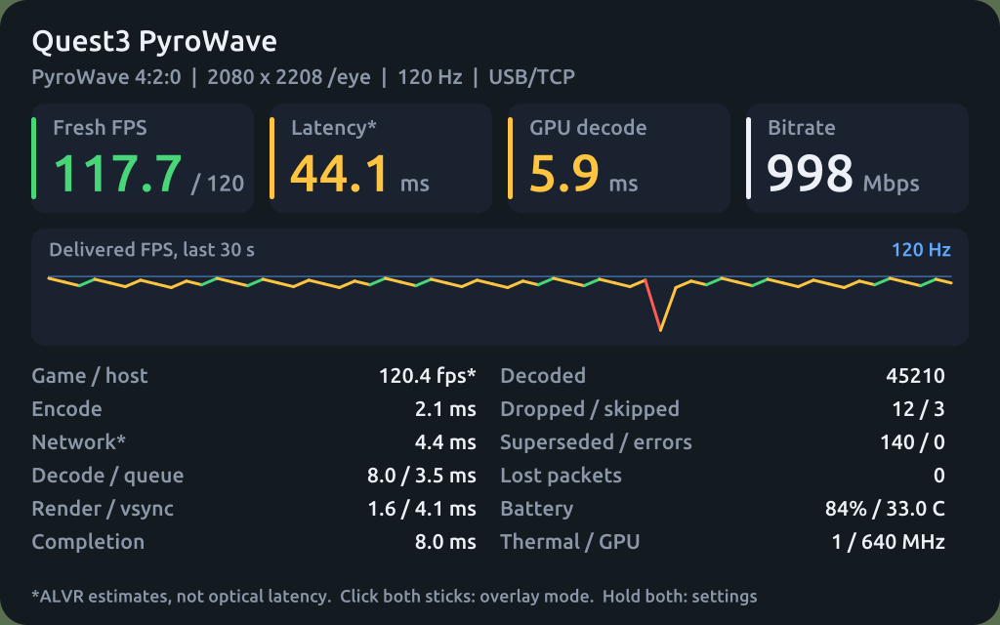
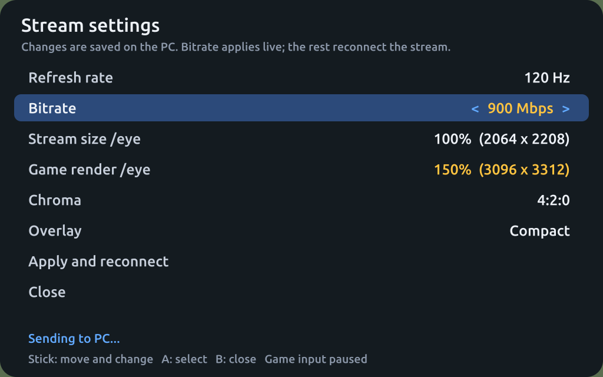

# Client performance overlay

## Current behavior: overlay modes and headset settings menu

Added in `.55`, released in alpha.9 (`.63`) and also on main (`.64`).
The `.55` build had a short Quest 3 Compact/Hidden comparison and correct stereo
screenshot endpoints. A controlled in-headset acceptance test of the menu's
Apply/restart path is still pending. alpha.8 (`.51`) and earlier builds behaved as
described in [Earlier behavior](#earlier-behavior-51-and-before). Preview images are rendered by the same CPU code
the headset uses (`PANEL_PREVIEW=<dir> cargo test -p alvr_graphics preview_dump`),
over a flat background:

| Compact (default) | Full | Settings menu |
| --- | --- | --- |
|  |  |  |

**Controls.**

- **Click both thumbsticks** and release: Compact strip → Full panel → Hidden → Compact.
  Release both sticks before the next click.
- **Hold both thumbsticks** for about 0.7 s: open or close the settings menu. A hold does
  not also change the overlay mode.
- In the menu, either stick moves up/down between rows and left/right changes a value
  (holding repeats). **A or X** selects, **B or Y** closes without applying.

**Compact** shows delivered (fresh) FPS against the refresh rate, ALVR's estimated
latency and PyroWave GPU decode time. **Full** adds bitrate, a 30-second delivered-FPS
graph against the refresh rate, and the detailed counters the `.51` panel listed.
Colors are fixed thresholds, not acceptance results: FPS green at ≥97% of the refresh
rate and amber at ≥85%; latency green at ≤30 ms and amber at ≤45 ms (estimated, not
optical); GPU decode green at ≤70% and amber at ≤90% of the frame period.

**Menu.** Rows: refresh rate (only the rates this headset confirmed at startup),
bitrate (100–4000 Mbps in 50 Mbps steps; at 207 Hz the measured useful range ends near
1250 Mbps on Wi-Fi 6E and 1500 Mbps over USB, see [BITRATE.md](BITRATE.md)), stream size per eye (50–100% of the
2064×2208 panel in 10% steps), game render size per eye (100–200% in 25% steps; the PC
filters it down to the stream size, so it costs PC GPU time only), chroma (PyroWave
only) and overlay mode. The size steps match the dashboard's scales. Changed values show in amber. **Apply** sends only
the fields you changed. The PC checks every value against the same ranges and the
headset's confirmed rates, rejects the whole request if any value is out of range,
and saves the rest to the session as a dashboard edit would. Bitrate takes effect
live (constant-Mbps mode). Any other change ends the stream with ALVR's normal
"restarting" message; the headset reconnects, and SteamVR restarts only if the
OpenVR configuration changed, through the same dashboard path used today. A streamer
without menu support never answers; after 3 s the menu says so.

While the menu is open the game sees every controller button and stick released;
when it closes, the game receives the current state. Head and controller tracking
continue. The menu is placed 1 m ahead at the head's yaw when opened and stays put
in LOCAL space (head-locked if tracking is invalid); a recenter re-anchors it.

**Cost.** Panels are rasterized on a worker thread at most twice a second (on each
input change while the menu is open). The render loop only uploads a finished image
into the quad swapchain, so the `.51` per-redraw CPU text work no longer runs on it.
`[Q3PW_OVERLAY_DRAW]` keeps its fields (`text_cpu_ms` now measures building the view on
the render thread) and adds `raster_worker_ms`. No per-frame GPU work is added: as
before there is one quad layer, reused by the compositor between updates. This does not
establish zero compositor cost. The `.55` Compact/Hidden screen delivered
119.09/118.71 unique fresh FPS with similar completion times; no repeatable
overlay delivery penalty was isolated. [Measurements and limits](PR-9-REVIEW.md).

`debug.q3pw.overlay_visible` still works: `0` hides, `1` shows Full if the
controller mode is Hidden (otherwise the controller's mode), unset follows the
controllers.

## Earlier behavior (.51 and before)

This section is the record for alpha.8 (`.51`) and earlier builds. In current builds the
chord cycles Compact → Full → Hidden instead of toggling on/off, and the panel content is
as described above. The `debug.q3pw.overlay_visible` override, the metric definitions
and the log-summary tool below still apply.

The Quest app displays a head-relative OpenXR quad below the center of view, at
1.2 m depth, visible in both eyes. The panel is rendered locally alongside the video;
its text is not compressed into the PC stream. It is **on by default for development**.

Click **both thumbsticks together** to toggle it. Holding the chord toggles once;
release both sticks before the next toggle. It works without the PC dashboard.
Controller actions still reach the game, so a game binding to these buttons can also fire.
The toggle lasts for the current app/session; reopening the app defaults to on.

Experimental `.24` adds `debug.q3pw.overlay_visible` for unattended comparisons:
`0` forces hidden, `1` forces visible, and empty/other values use the controller
state. The app polls this property at most twice per second, including while hidden;
it takes effect without restarting the app or stream. The controller chord still
updates its session state underneath an override, which wins while set. Clearing
the property restores that controller state. The normal unset default stays on.
Snapshot and restore the original property along with the rest of a bounded test.

If both thumbsticks cannot hide the panel after a benchmark, check for a leftover
forced-visible override. Clear it before normal play; `1` intentionally overrides
the controller chord. From PowerShell, using your connected Quest's serial:

```powershell
adb -s YOUR_QUEST_SERIAL shell 'setprop debug.q3pw.overlay_visible ""'
adb -s YOUR_QUEST_SERIAL shell getprop debug.q3pw.overlay_visible
```

The readback should be empty. Release both sticks, then click both together.
No APK update or SteamVR restart is needed. Leave the property unset in manual
play launchers; the overlay already starts enabled by default.

With `debug.q3pw.loop_probe=1` set before launching `.24`, `[Q3PW_OVERLAY_DRAW]`
records text construction, graphics-context/acquire/wait, renderer submission and
release wall times for each redraw. `[Q3PW_LOOP]` also reports total overlay-update
CPU-wall mean/maximum over its frame window. Renderer submission includes CPU
font rasterization and command submission; it does **not** measure completed GPU
work. Property mode and effective visibility changes have native diagnostic logs.
No render ordering or GPU synchronization changes accompany these diagnostics.
Matching Android/Windows builds and a same-session visible/hidden/visible comparison
are required before attributing any pacing problem to the overlay.
The matching `.24` pair passed all cloud checks, hashes, embedded version and
signing review; [artifact evidence](../results/OVERLAY-CONTROL-CI-2026-10-02.json).
It was subsequently installed as a matching pair for authorized remote tests.
No overlay performance gain is claimed.

Summarize a saved `logcat -v epoch` from that client process without accessing a
device: `python -m tools.quest3.overlay frame-loop.log --start START_UNIX_SECONDS
--end END_UNIX_SECONDS --pid RECORDED_CLIENT_PID --out overlay-timing.json`.
Use the actual frame-capture interval, not the later log-download time. The reader
filters other processes/intervals, preserves control/visibility transitions, weights
per-frame means by the recorded sample count, and reports missing timing as unknown.
Loop records cover frame windows ending inside the interval and may overlap its
start; compare settled cases and review the controls separately. It does not
declare a visibility or performance pass. Share reviewed summaries, not raw logs.

The [six .24 same-session screens](../results/OVERLAY-LIVE-2026-10-02.json) used
native120/1000-Mbps 4:2:0, no foveation, the same chart and no client restart.
Visible / hidden / visible delivered 102.63 / 100.11 / 106.64 fresh submissions/s;
hidden / visible / hidden delivered 111.79 / 103.78 / 96.72. Reported clock samples
were 690 MHz throughout, while the headset warmed. These short screens found no
repeatable FPS/p1 or latency gain when hidden. Visible updates averaged about
0.09–0.10 ms CPU per loop frame, with 6.4–6.9 ms maxima. Hidden updates averaged
0.007–0.009 ms and produced no redraw records. The default stays on. CPU cost is
measurable, but hiding the panel did not establish sustained native120 or optical
latency acceptance. Matching source coverage and property-mode logs were checked.

The panel shows codec/chroma, per-eye stream size, requested refresh, transport,
actual/target bitrate, delivered client FPS, Game/host FPS, pipeline latency and
game/encode/network/decode/queue/render/vsync stages, presented frames, packet loss,
PyroWave GPU/completion time and decoded/dropped/skipped/superseded/error counters,
battery temperature/charge, thermal status and readable GPU clock.

**Metric definitions:**

- Game/host FPS is the server's present cadence, a proxy for game output. It is not
  an independent application FPS counter and can include SteamVR resubmitted frames.
- Delivered FPS counts new client submissions. It is distinct from the display's
  refresh rate and from reprojected repeats. FPS smoothing averages intervals, not rates.
- Latency is ALVR's estimated tracking-to-predicted-display pipeline, not optical
  motion-to-photon. Network is the residual estimate, especially limited on PWU2 UDP.
- Frames/counters are cumulative for the current stream; superseded means an
  unpresented ready/queued frame was replaced. These categories should not be added
  together as if every counter represented a distinct lost display frame.
- Completion timing includes command recording/submit and wait for GPU completion.
  GPU decode uses timestamps. They measure different scopes.
- Missing counters or unreadable GPU sysfs values display `--`. A stopped/stale stream
  displays a waiting message, rather than retaining apparently healthy values.

Server feedback arrives once per second; the small panel texture updates at most
twice per second and is reused by the compositor between updates. The overlay adds
one composition layer and some CPU/GPU work. Measure its overhead in matched on/off
captures before making performance claims. Initialization/render errors disable the
overlay and leave video running. Physical thumbstick usability and in-headset text
placement are part of hardware acceptance, beyond the chord regression tests.

The .7 build passed cloud checks, displayed live statistics in both eyes and had
its physical thumbstick toggle confirmed by the owner. Device screenshots exposed
an upside-down texture origin; .8 corrects the GLES/OpenXR texture orientation and
has passed matching Android/Windows builds and cloud regressions. A .8 device
screenshot confirmed upright text and the panel in both eyes during USB streaming.
Do not use .7 as the final overlay acceptance build. Matched on/off overhead and
long-duration gameplay checks remain pending.
